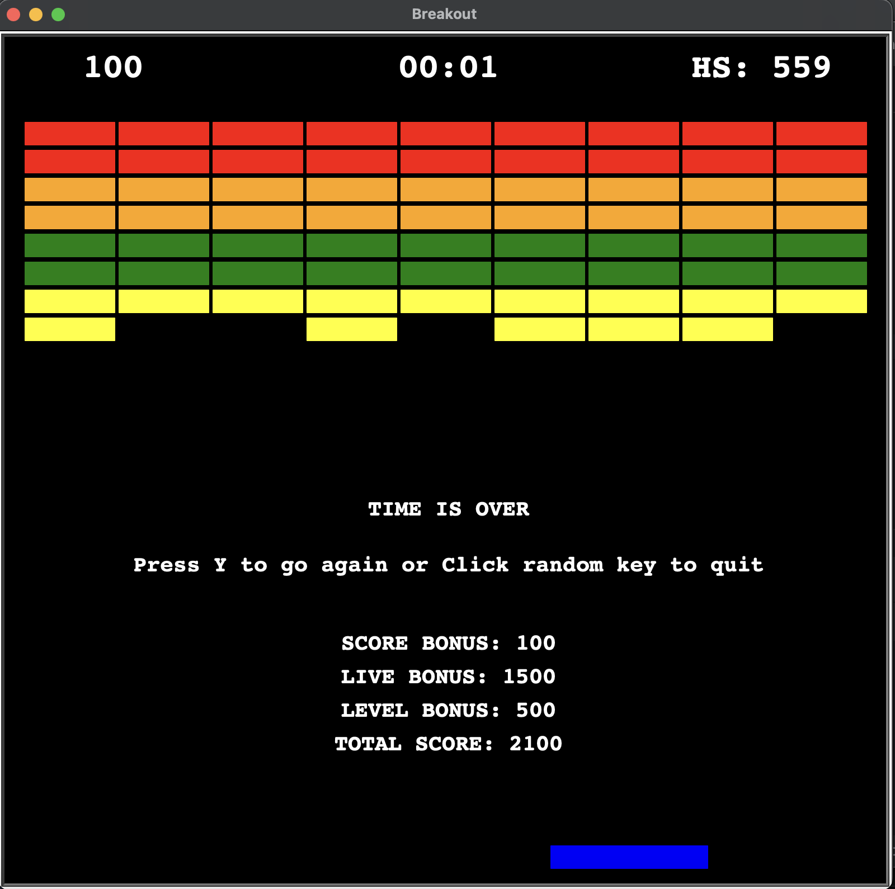

# Table of Contents

- [Game Overview](#game-overview)
- [Features](#features)
- [How to Play](#how-to-play)
- [Highscore](#highscore)
- [Requirements](#requirements)
- [Installation](#installation)
- [Usage](#usage)
- [Contributing](#contributing)
- [License](#license)

---


## Game Overview
<a name="game-overview"></a>

This is a classic Breakout game with a twist! See how many levels you can clear before time runs out. Compete for the highscore and challenge your reflexes.

## Features
<a name="features"></a>

- Classic Breakout gameplay with a time-based twist.
- Multiple levels with increasing difficulty.
- Colorful bricks and dynamic ball movement.
- Highscore tracking to compete with yourself and others.
- Fun and challenging gameplay to test your reflexes.

## How to Play
<a name="how-to-play"></a>

- Use the Left and Right arrow keys to control the paddle.
- Press S to start the game.
- Press Space to pause and resume the game.
- If game over, press Y to restart or random key to quit
- Try to break as many bricks as you can before the time runs out.
- Clear levels to increase your score and reach the highscore.
- Enjoy the game and challenge your friends to beat your highscore.

## Highscore
<a name="highscore"></a>

Compete for the highest score and see if you can beat your previous records. Your highscore is displayed in the game, so aim for the top spot!

## Requirements
<a name="requirements"></a>

- Python 3.x
- Python Turtle Graphics Library

## Installation
<a name="installation"></a>

1. Make sure you have Python 3.x installed on your computer.

2. Download or clone this repository to your local machine.
git clone https://github.com/macbrina/breakout-hit-game.git


## Usage
<a name="usage"></a>

1. Navigate to the game directory in your terminal.
````
cd breakout-game
````
2. Run the game by executing the following command:
````
python main.py
````
3. Follow the on-screen instructions to play the game.


## Contributing
<a name="contributing"></a>

Contributions are welcome! If you have any ideas, bug fixes, or improvements, feel free to open an issue or submit a pull request.

## License
<a name="license"></a>

This project is licensed under the [MIT License](LICENSE).
